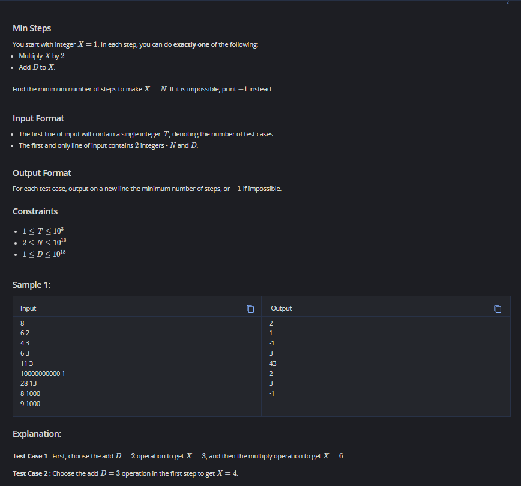
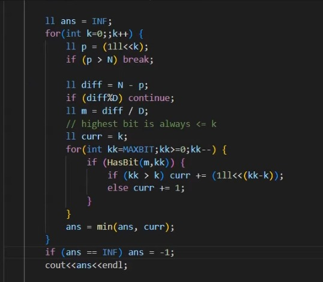

## Problem Restatement

* You start with **X = 1**.
* At each step, you can:

  1. Multiply X by 2.
  2. Add D to X.
* Goal: Reach exactly **N** in the fewest steps. If impossible, output -1.

---

## Key Insights

### 1. Two kinds of moves

* **Multiply by 2:** grows your number exponentially.
* **Add D:** grows linearly.

This mix is tricky: multiplication is fast, but it only works well if you’re already close to the target. Addition helps "adjust" the value to eventually hit **N**.

---

### 2. Thinking Backwards

Instead of starting from **1 → N**, the logic is easier if you think:
**"What if I try to imagine how N could have been formed?"**

* Maybe the last step was "multiply by 2". That means the previous number was **N / 2** (only valid if N is even).
* Maybe the last step was "add D". That means the previous number was **N - D** (only valid if ≥ 1).

So, the problem becomes like **reverse-engineering** how N can be decomposed into 1 by repeatedly undoing operations.

---

### 3. Binary Representation Idea

Notice:

* Multiplying by 2 is like shifting bits left in binary.
* Adding D adjusts the number to "fit" before multiplication.

That means the problem is linked to how **N − some multiple of D** can become a power of two.

Because from **X = 1**, multiplying by 2 repeatedly gives you powers of two: 1, 2, 4, 8, 16, …
So, at some stage, you need to make your number "line up" with a power of two by adjusting with additions of D.

---

### 4. Breaking the Approach

The solution tries every possible number of doublings first. Let’s call that **k**.

* Suppose after k doublings, you would have **2^k**.
* But we don’t start from **0**—we start from 1, so really that gives **p = 1 × 2^k**.

Now, to hit exactly **N**, we need:
[
N = p + m \cdot D
]

where **m** is how many times we added D.

So the difference must satisfy:
[
N - p \equiv 0 \pmod{D}
]

If not divisible, this path is impossible.

---

### 5. Counting Steps

If it *is* divisible, then:

* You already spent **k** steps on doublings.
* You also need steps for additions. But here’s the subtle part: additions may not just be “m” directly, because sometimes you can merge the effect of additions with the binary structure.

The inner loop in the code handles this using binary decomposition of **m**. Basically:

* Express **m** in binary.
* Each 1-bit in m corresponds to an addition that must have happened **before a certain doubling**.
* So, the total cost = k (doublings) + number of 1s in binary(m), adjusted for where the bits fall.

This is why the solution checks bits from high to low.

---

### 6. Final Check

We try every possible **k** (number of doublings) until 2^k exceeds N.

* For each, we see if **N − 2^k** is divisible by D.
* If yes, calculate steps = k + “cost of additions”.
* Take the minimum across all valid k.
* If none worked → -1.

---

## Example Walkthrough

### Example: N = 6, D = 2

* Try k = 1 → p = 2.
  N − p = 6 − 2 = 4. Divisible by D = 2 → yes.
  m = 2. Binary(2) = 10 → cost = 1 extra.
  Steps = 1 (doubling) + 1 (addition setup) = 2.

Answer = 2.

---

### Example: N = 4, D = 3

* Try k = 0 → p = 1. N − p = 3, divisible by 3 → yes.
  m = 1. Binary(1) = 1 → cost = 1.
  Steps = 0 doublings + 1 addition = 1.

Answer = 1.

---

### Example: N = 9, D = 1000

* For all k, N − 2^k < 1000 and not divisible by 1000.
* No valid path. → -1.

---

## Key Takeaway

The math boils down to:

1. Powers of two from multiplications.
2. Differences bridged by additions of D.
3. Binary decomposition decides how many addition steps are truly needed.
4. Minimum across all possible doubling counts.

## Solution:

## Resources:
- [Problem link](https://www.codechef.com/problems/MINST)
- [TLE ELiminators Video](https://www.youtube.com/live/eLbkD4I5njY?si=_nAGM3ATMI3Sq0Mh&t=4619)

