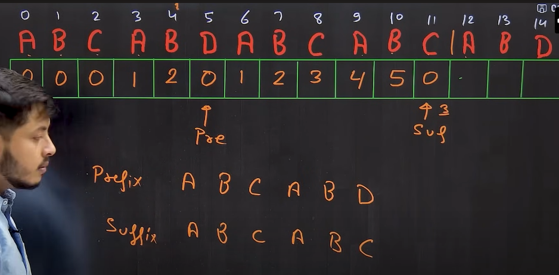

# KMP string matching algorithm

<<<<<<< HEAD
TC : 0(m+n) `m is the lenght of string and n is the lenght of pattern`  
=======

TC : 0(m+n) `m is the length of the string and n is the length of the pattern`   
>>>>>>> 161a5ceebc68985731d0abe90d96e1ff62fb73dc
SC : 0(m)

### Resources:
- [KMP code -CodeStoryWithMIK](https://github.com/MAZHARMIK/Interview_DS_Algo/blob/master/strings/String%20Algorithms/Knuth-Morris-Pratt%20KMP%20String%20Matching%20Algorithm.cpp)
- [KMP code using easy trick - Aryan Mittal](https://codewitharyan.com/tech-blogs/knuth-morris-pratt-(kmp)-algorithm)
- [Understanding LPS intuition - CoderArmy](https://youtu.be/sODA1BzFvsE?si=xeYvU8NtZUeet4Ww)

Problem Link:
- [Implement LPS - Longest prefix that matches the suffix (gfg)](https://www.geeksforgeeks.org/problems/longest-prefix-suffix2527/1)
- [Implement LPS - Leetcode](https://leetcode.com/problems/longest-happy-prefix/submissions/1648538980/)
<<<<<<< HEAD
- [Implement KMP - gfg](https://www.geeksforgeeks.org/problems/search-pattern0205/1)
=======
- [Implement Search pattern KMP - gfg](https://www.geeksforgeeks.org/problems/search-pattern0205/1)
>>>>>>> 161a5ceebc68985731d0abe90d96e1ff62fb73dc
- [My KMP List - Leetcode](https://leetcode.com/problem-list/23qqo7sg/)
